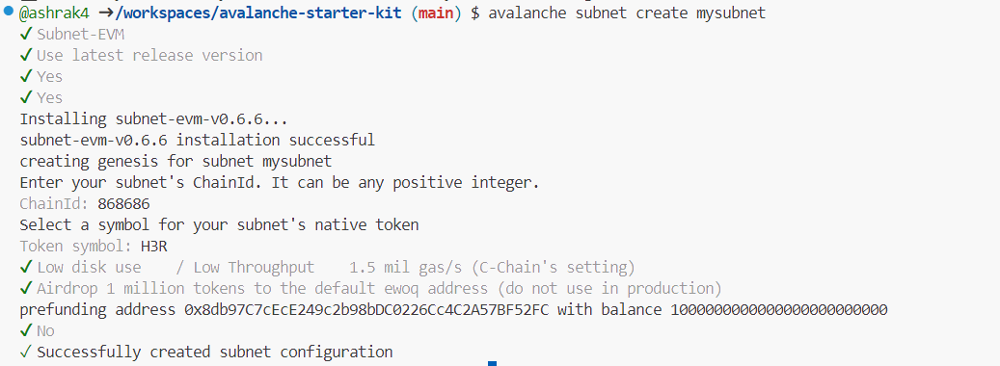
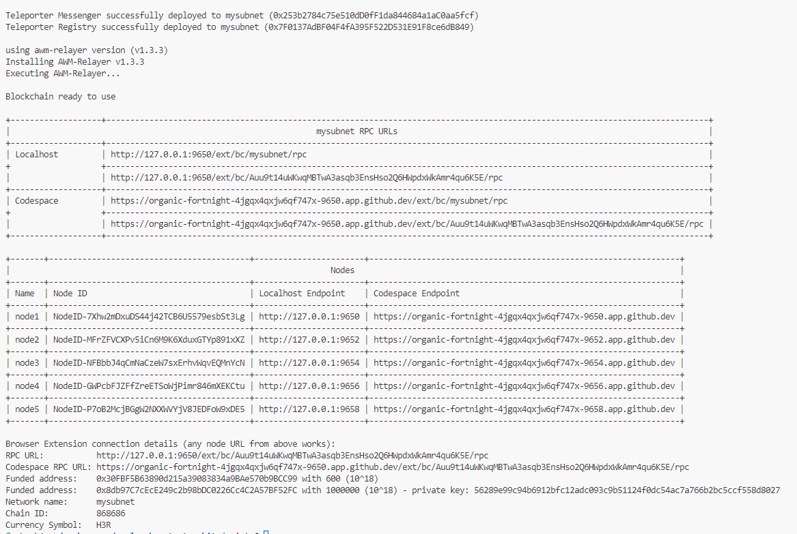
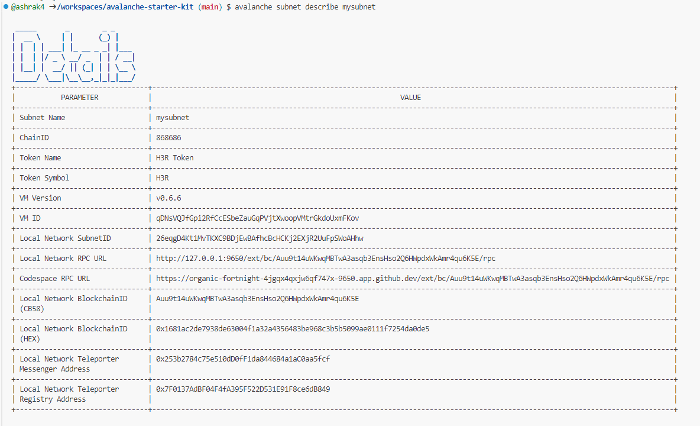
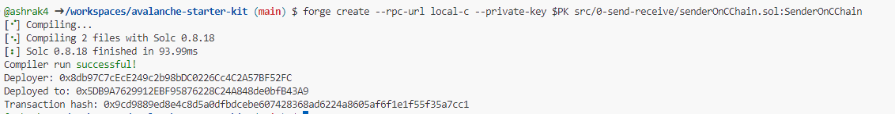
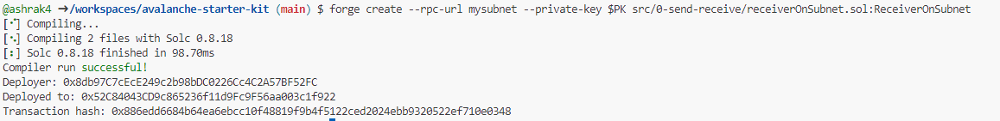
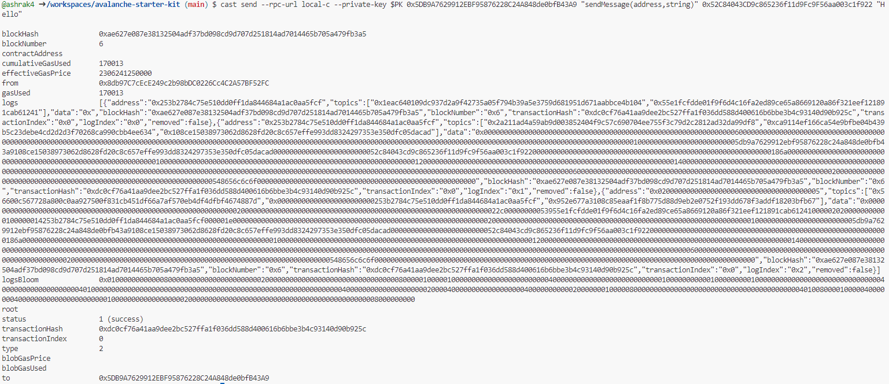
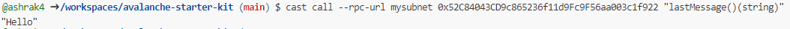

# Challenge
1. Deploy a Subnet

# Solution

1. Create Subnet

2. Deploy Subnet

3. Describe Subnet for Blockchain ID

4. Deploy Sender Contract

5. Deploy Receiver Contract

6. Send message from sender to receiver

7. Verify Message on receiver end

